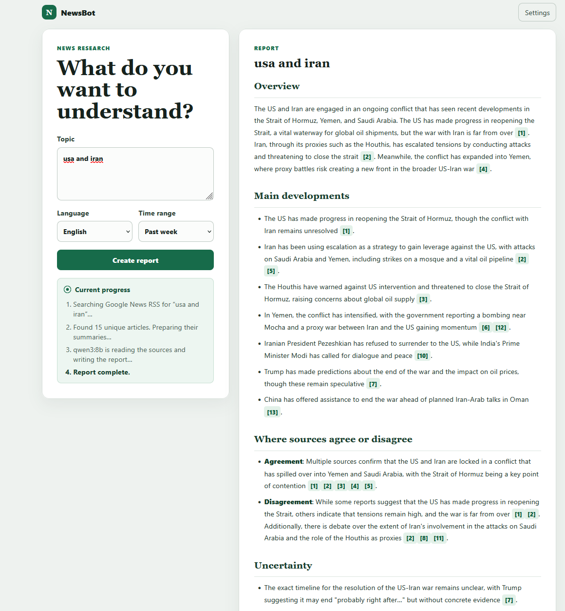

# NewsBot

NewsBot searches recent news and turns the results into a short report with
numbered sources. It uses Google News RSS, with optional NewsAPI results, and can
generate reports with local Ollama or an OpenAI-compatible API.

## Demo



## Features

- English and German news searches
- Duplicate article removal
- Live progress messages
- Formatted reports with citations
- Local storage for API settings

## Run on Windows

1. Create a virtual environment:

   ```powershell
   py -m venv .venv
   ```

2. Install the packages:

   ```powershell
   .\.venv\Scripts\python.exe -m pip install -r requirements.txt
   ```

3. Start the app:

   ```powershell
   .\.venv\Scripts\python.exe -m uvicorn app.main:app --reload
   ```

4. Open [http://127.0.0.1:8000](http://127.0.0.1:8000).

The first screen asks for the model settings. Google News RSS works without a
key, and NewsAPI is optional. The local `.env` file is ignored by Git.

## Tests

Install the development requirements and run the tests:

```powershell
.\.venv\Scripts\python.exe -m pip install -r requirements-dev.txt
.\.venv\Scripts\python.exe -m pytest
```
